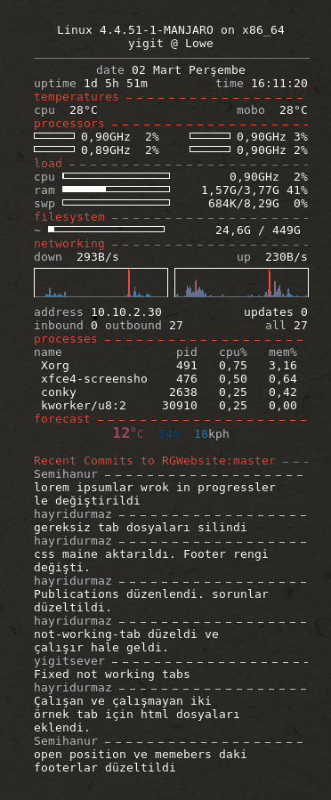

Just my simple conky config

I probably reinvented something with my github .atom reader

got WUTemp.py from [douyousketch2](https://github.com/doyousketch2)
slightly edited it to support cities outside US
